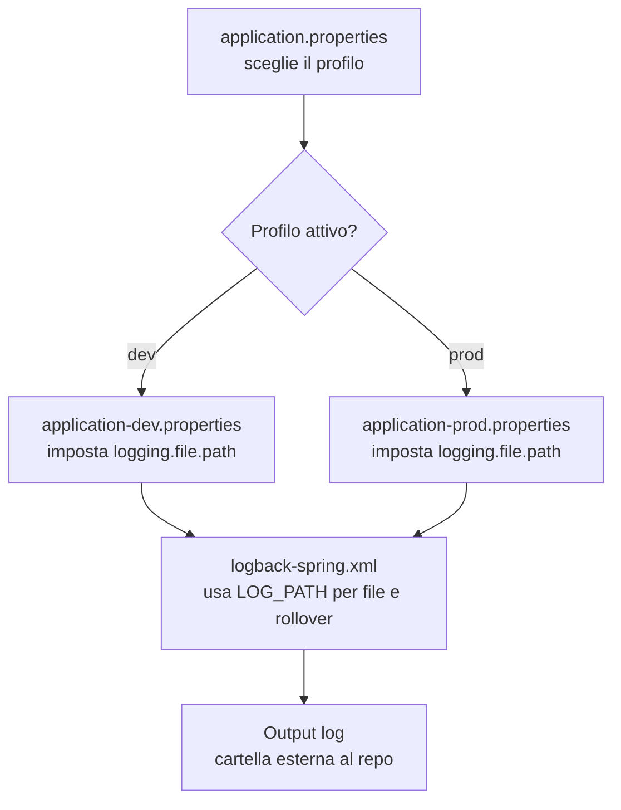

# Schemi figurativi: percorsi dei log e passaggi tra file

Di seguito trovi schemi visivi che mostrano:
1. Come era il flusso prima
2. Come è adesso il flusso dopo la modifica
3. I passaggi tra file di configurazione

---

**Schema 1 — Prima (percorsi “misti”)**

```mermaid
flowchart LR
    A[application.properties\nspring.profiles.active=dev] --> B[application-dev.properties\nlogging.file.name=.../comicverse-dev.log]
    A --> C[application-prod.properties\nlogging.file.name=C:/logs/.../comicverse-prod.log]
    B --> D[logback-spring.xml\nfile = logging.file.name]
    C --> D
    D --> E[File corrente\n.../comicverse-dev.log o .../comicverse-prod.log]
    D --> F[Rollover\nlogs/comicverse.YYYY-MM-DD.i.log\n(dentro repo)]
```

**Cosa succedeva prima**
- Il file “corrente” andava **fuori dal repo**.
- I file di rollover finivano **dentro `logs/` nel repo** perché il path era hardcoded.

---

**Schema 2 — Dopo (percorsi unificati)**

```mermaid
flowchart LR
    A[application.properties\nspring.profiles.active=dev] --> B[application-dev.properties\nlogging.file.path=.../comicverse-logs/dev]
    A --> C[application-prod.properties\nlogging.file.path=C:/logs/comicverse]
    B --> D[logback-spring.xml\nLOG_PATH=logging.file.path]
    C --> D
    D --> E[File corrente\n{LOG_PATH}/comicverse.log]
    D --> F[Rollover\n{LOG_PATH}/comicverse.YYYY-MM-DD.i.log]
```

**Cosa succede ora**
- File corrente e rollover **stanno nello stesso percorso**.
- Nessun file log viene più scritto dentro il repo.

---

**Schema 3 — Passaggi tra file (chi decide cosa)**



---

**Percorsi effettivi (esempi)**
- Dev: `C:\Users\alessio.deamicis\comicverse-logs\dev\comicverse.log`
- Prod: `C:\logs\comicverse\comicverse.log`

---

**Nota**
Se vuoi nomi file diversi per dev/prod (es. `comicverse-dev.log`), posso aggiungere una proprietà dedicata e aggiornare lo schema. 
